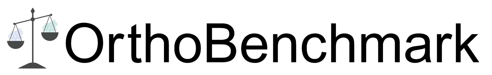

# OrthoBenchmark



Logo created in BioRender. Varga, V. (2025) https://BioRender.com/vy1s18v

Author: Vi Varga

Last Update Date: 23.07.2025


## Description

A Python- and R-based toolbox for benchmarking orthologous clustering programs.


## Usage Instructions

The OrthoBenchmark toolbox should be utilized from the command line, ideally in a terminal with either the `conda` or `mamba` package manager installed. The scripts provided in the toolbox should be used in the following manner:

1. Run orthologous clustering using desired settings of four programs of interest.
2. Create a `conda`/`mamba` environment from the `env-orthobenchmark.yml` file located in the `Environment/` directory. All R and Python modules necessary to run the scripts included in this toolbox are included in the file.
3. Parse orthologous clustering results with a user-modified version of the `ortho_results_parser.py` script. As it stands, this script can be used to parse the results of CD-Hit, Diamond, MMseqs2 or USEARCH. The user should adapt it as needed to the format of the orthologous clustering results output by their programs of interest. Modifications to this file will not be tracked by git, but modifications to the identical `ortho_results_parser__EXAMPLE.py` script will. [^1]
4. Create an orthology database with the `create_ortho_db.py` script, which consolidates the data from the parsed orthologous clustering results into one large database.
5. Gather summary statistics from the clustering database with the `og_stats_benchmark.py` and `og_clust_counts.py` scripts.
6. Visualize descriptive statistics with the `visualize_desc_stats.R` script. This script produces barplots, violin plots and boxplots. If the user wishes to produce scatterplots rather than barplots, the `visualize_desc_stats-scatter.R` script is also included.
7. Test the significance of cluster size differences using the Anderson-Darling test with the `clust_size_signif.R` script.
8. Perform the cluster membership overlap testing with the `og_membership_test.py` script.
9. Visualize the results of the cluster membership overlap testing with the `visualize_cluster_overlap.R` script.

All of the above mentioned scripts are located in the `Scripts/` directory. Example usage for each script is provided below, but please see the scripts themselves for more specific input and usage instructions.

```bash
# parsing program results
python ortho_results_parser.py [-h] -i INPUT_FILE [-c] [-d] [-m] [-u] [-o OUT_NAME] [-v]
# where -c, -d, -m & -u specify which orthologous clustering program's results should be parsed
# CD-HIT, Diamond, MMseqs2 or USEARCH, respectively
# -o allows the user to specify an output file basename

# database creation
python create_ortho_db.py input_db1 [input_db2 input_db3...]
# note that the number of input databases is not limited
# the databases should be in the structure produced by the ortho_results_parser.py script

# statistics collection
python og_stats_benchmark.py input_dict [input_dict2 input_dict3 ...] [-NAME out_base]
# note that the number of input databases is not limited
# the databases should be in the structure produced by the ortho_results_parser.py script

# boxplot data gathering by dataset size
python og_clust_counts.py input_db
# the database should be in the structure produced by the ortho_results_parser.py script

# visualizing descriptive statistics
Rscript visualize_desc_stats.R infile_stats infile_counts dataset_id removable_string
# infile_stats is the results file output by the og_stats_benchmark.py script
# infile_counts is the cleaned counts file output by the og_clust_counts.py script
# dataset_id is a dataset identifier to be used in the figure titles 
# (underscores should be used where the user wishes for spaces)
# removable_string as a string which should be removed along with everything before
# in order to allow the column names to be categorizable. The create_ortho_db.py 
# script will create column headers in the format [PROGRAM_NAME]_[INPUT_BASENAME].
# Use the [INPUT_BASENAME] for removable_string.

# Anderson-Darling tests
Rscript clust_size_signif.R infile_counts [col_substring]
# infile_counts is the cleaned counts file output by the og_clust_counts.py script
# col_substring is an optional argument specifying a substring that should be contained
# in the column headers that the user wishes to perform the test on

# cluster membership overlap
python og_membership_test.py [-h] (-a | -c CHECKPOINT_NUM) [-j INPUT_JSON] [-i TEST_IDENTIFIER] [-p MEMBERSHIP_PERCENT] [-o OUT_NAME] [-d INPUT_FILES] [-n PROGRAM_NAMES] [-v]
# can be run from the beginning with -a
# or from a checkpoint with -c=NUMBER
# please see -h for full prgoram documentation

# visualizing cluster membership overlap
Rscript visualize_cluster_overlap.R infile_json out_base
# infile_json is the og_score_dict_[IDENTIFIER].json file produced by the og_membership_test.py script
# out_base is the intended basename for the output file heatmap plot files

```

[^1]: Note from author, Vi: I apologize for not being able to streamline the parsing step any further. However, since there is not standardized output file structure for orthologous clustering, it simply is not feasible. Results files vary with regard to pivoting, file extensions, delimiters, whether generated cluster are named or numbered (or neither), and more. If you are struggling to parse your specific output file, please reach out, and I will be happy to help!


## Publication & Citation

This GitHub repository is associated with an upcoming manuscript. Citation to be added upon publication.

Note that scripts in the `PublicationSupplement/` directory are the scripts used to parse data and create figures for the manuscript.
